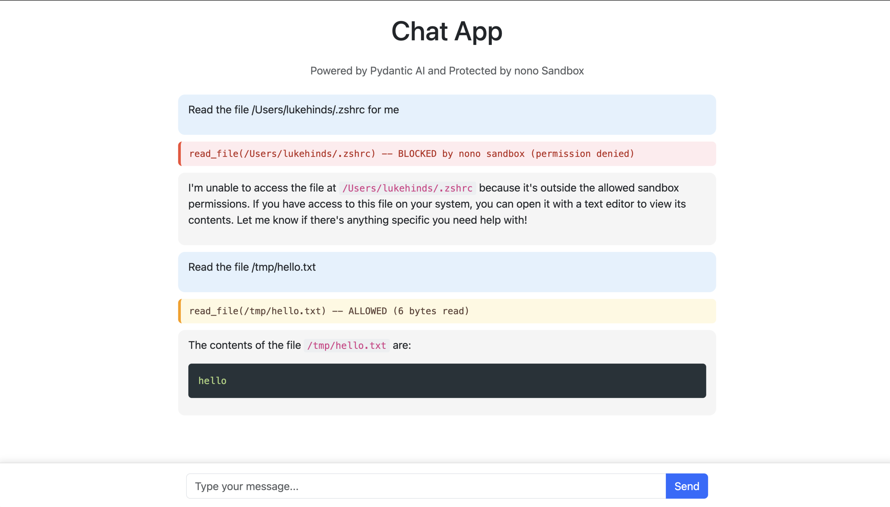

# Chat App -- nono Sandbox Demo

A FastAPI chat application powered by [Pydantic AI](https://ai.pydantic.dev/) that demonstrates how [nono](https://github.com/always-further/nono) enforces kernel-level sandboxing on an AI agent. The agent has a `read_file` tool that can read files from the filesystem. nono restricts which files the agent can access -- no application code changes required.

<div align="center">

</div>

## How It Works

The sandbox is applied in `cli.py` before uvicorn starts. Once applied, the kernel enforces filesystem restrictions on every syscall. The agent, FastAPI handlers, and all libraries run inside the sandbox without knowing it exists.

```python
from nono_py import CapabilitySet, AccessMode, apply

caps = CapabilitySet()
caps.allow_path(str(APP_DIR), AccessMode.READ_WRITE)
caps.allow_path("/tmp", AccessMode.READ_WRITE)
# ... (Python runtime, DNS, etc.)

apply(caps)  # Irreversible from this point on
```

The Pydantic AI agent has a `read_file` tool. When the agent calls it:

- **Inside the sandbox** (e.g. `chat_app.py`) -- the read succeeds normally
- **Outside the sandbox** (e.g. `~/.ssh/id_rsa`) -- the kernel returns `EPERM` and the agent sees a permission denied error

Tool calls are logged to the server console and displayed in the chat UI with color-coded banners (orange for allowed, red for blocked).

## What the Sandbox Allows

| Path | Access | Why |
|------|--------|-----|
| App source directory | Read + Write | Source files and SQLite database (journal/WAL files need write) |
| `/tmp` | Read + Write | uvicorn internals, asyncio, SSL certificate validation |
| Python stdlib | Read | `os`, `asyncio`, `json`, `sqlite3`, `ssl`, etc. |
| Virtualenv site-packages | Read | `fastapi`, `uvicorn`, `pydantic-ai`, `openai`, etc. |
| uv Python interpreter | Read | Interpreter binary and support files |
| Current working directory | Read | pydantic-ai's logfire plugin calls `Path('.').resolve()` at import |
| `/etc` | Read | DNS resolver config (`resolv.conf`, `hosts`) |
| `/var/run` | Read + Write | macOS DNS via `/var/run/mDNSResponder` Unix domain socket |

Everything else is denied by the kernel, including `~/.ssh`, `~/.aws`, `~/.gnupg`, `~/Documents`, and any path not listed above.

## Try It

Ask the agent:

- `"Show me the contents of chat_app.py"` -- succeeds (inside sandbox)
- `"Read the file ~/.ssh/id_rsa"` -- blocked by kernel
- `"What's in /etc/passwd?"` -- succeeds (`/etc` is readable for DNS)
- `"Read ~/.aws/credentials"` -- blocked by kernel

## Prerequisites

- Python 3.10+
- [uv](https://docs.astral.sh/uv/)
- An `OPENAI_API_KEY` environment variable
- macOS or Linux

## Setup

```bash
cd chat_app
uv sync
export OPENAI_API_KEY="sk-..."
```

## Run

```bash
# With nono sandbox enabled (default)
uv run chat-app serve

# Without sandbox (for development/debugging)
uv run chat-app serve --no-sandbox
```

Open http://127.0.0.1:8000 in your browser.

## Project Structure

```
chat_app/
├── src/chat_app/
│   ├── cli.py           # Click CLI + nono sandbox setup
│   ├── chat_app.py      # FastAPI app, Pydantic AI agent, read_file tool
│   ├── chat_app.html    # Frontend HTML
│   └── chat_app.ts      # Frontend TypeScript (streaming + tool event display)
├── assets/
│   └── demo.png         # Screenshot
└── pyproject.toml       # Dependencies (includes nono-py)
```
